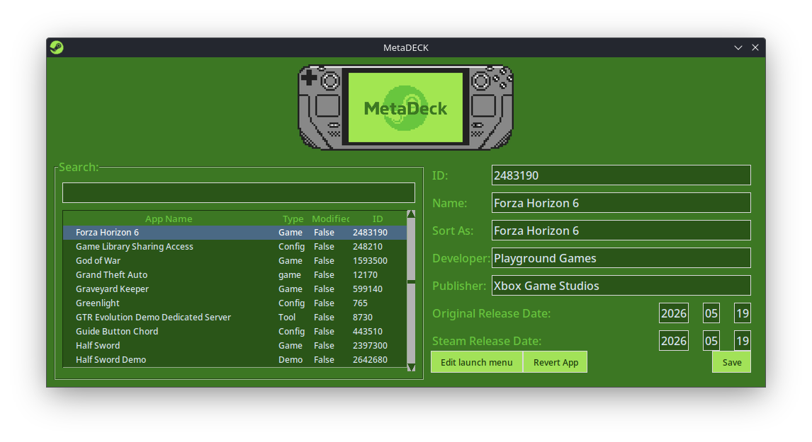
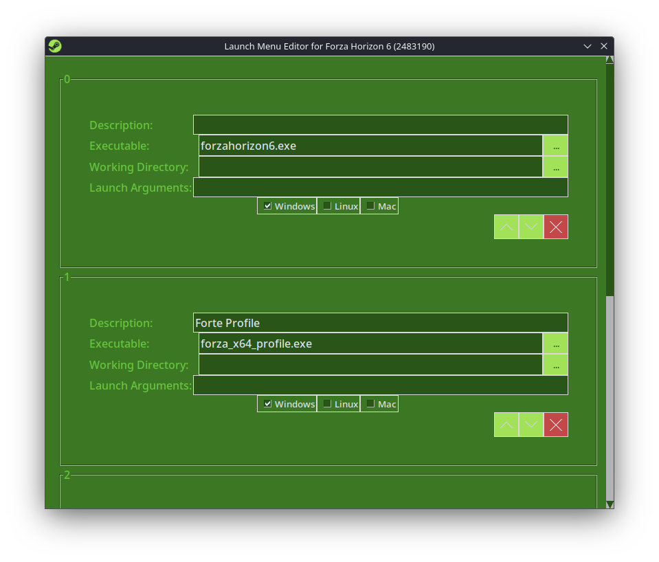

<div align="center">

# MetaDECK

</div>

<p align="center">
  
</p>

<br>

<div align="center">
  
A fork of [Steam Metadata Editor](https://github.com/tralph3/Steam-Metadata-Editor) by tralph3, redesigned and compiled specifically for **SteamOS on Steam Deck**.

MetaDECK lets you rename your Steam games and add custom launch menu options — just like SteamEdit used to do on Windows.

</div>

---

## Features

- Rename any Steam game in your library
- Add or edit launch menu options
- Silent background patching on boot via autostart
- Fully standalone — no Distrobox, no Flatpak, no dependencies needed.
- MetaDECK bundles the following libraries into its standalone executable:

</small>
     - **Python 3** — core runtime
     - **Tkinter** — GUI framework
     - **Pillow** — image processing for logo and splash screen
     - **PyQt5** — transparent splash screen rendering</small>
     
<p align="center">
  
</p>
<p align="center">
  
</p>

---

## Installation

1. Download `metadeck.sh` from the [Releases](../../releases) page
2. Move it to a permanent location *(Home/Applications is the default directory on the Steamdeck)* :
   ```bash
   mkdir -p ~/Applications
   mv ~/Downloads/metadeck.sh ~/Applications/metadeck.sh
   chmod +x ~/Applications/metadeck.sh
   ```
3. Run it
   (Simply double-click it)

---

## Setup Silent Patching on Boot (CRUCIAL)

To automatically patch your metadata every time you boot into Desktop Mode:

1. Open **System Settings > Autostart**
2. Click **Add New > Login Script**
3. Navigate to **MetaDECK** and select it
4. Add this argument: `--splash-only` to the added script
5. Click OK

This will show the MetaDECK splash screen for 2 seconds on every login, silently patch your metadata, then close automatically.

---

## How it Works

MetaDECK edits Steam's `appinfo.vdf` file located at:
```
~/.local/share/Steam/appcache/appinfo.vdf
```

Your modifications are saved to:
```
~/.local/share/Steam-Metadata-Editor/config/modifications.json
```

---

## Limitations

- Cannot create launch options for games with no Linux depot on Steam
- Cannot add/edit launch options for Non-Steam games
- Cannot rename the first launch option of a game
- Some pre-existing launch options cannot be removed or renamed

---

## Credits

- Original project by [tralph3](https://github.com/tralph3/Steam-Metadata-Editor)
- MetaDECK logo is based on the pixelated artwork by Reddit user [ExxiIon](https://www.reddit.com/user/ExxiIon/)
- Shout out to Reddit user [WolfBoy980](https://www.reddit.com/user/WolfBoy980/) for his contributions 

---

## License
MetaDECK is open source and distributed under the **GPL License**, inheriting the same license as the original [Steam Metadata Editor](https://github.com/tralph3/Steam-Metadata-Editor) project by tralph3. You are free to use, modify, and distribute this software under the same terms.
